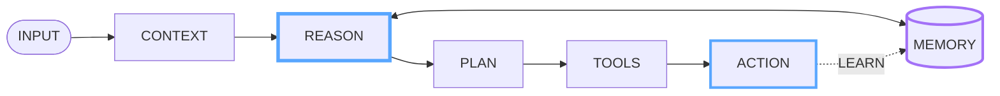
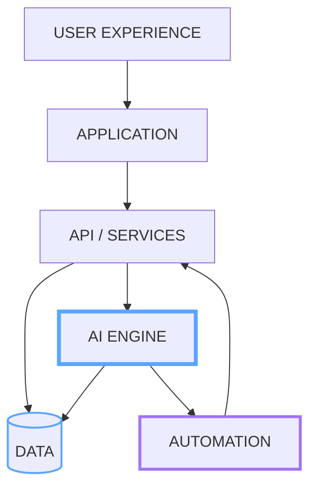
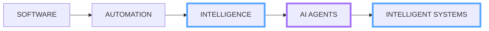

# HARISH

  

  

---

## AI CORE

**AI · DATA · TOOLS · MEMORY · AUTOMATION · SYSTEMS**

---

## ENGINEERING MODEL

I build end-to-end systems across **product interfaces, application logic, APIs, data, AI and automation**.

> **Turn real problems into reliable software — then add intelligence where it creates leverage.**

---

## AGENT LOOP

**Observe → Context → Reason → Plan → Tools → Act → Learn**

---

## BUILD ENGINE

### IDEA → DESIGN → BUILD → TEST → SHIP → OBSERVE → IMPROVE

---

## TECHNOLOGY

| Layer | Technologies | Role |
|---|---|---|
| **AI & Data** | Python · Jupyter | AI applications, automation, analysis and data workflows |
| **Frontend** | React · TypeScript · JavaScript | Interfaces, product UX and scalable web applications |
| **Backend** | Python · FastAPI · Node.js | APIs, services, business logic and integrations |
| **Data** | SQLite · Python tooling | Application persistence, structured data and analytics |
| **Web** | HTML · CSS · JavaScript | Web foundations and browser experiences |
| **Engineering** | Git · GitHub · VS Code | Version control, collaboration and development |

---

## SYSTEM ARCHITECTURE

---

## ENGINEERING PRINCIPLES

**Architecture** · Clear boundaries and reusable systems  
**AI** · Intelligence where it creates practical value  
**Automation** · Reliable workflows for repetitive work  
**Data** · Convert information into useful signals  
**UX** · Keep complex systems understandable  
**Iteration** · Build → observe → improve  
**Engineering** · Maintainability over unnecessary complexity

---

## LIVE GITHUB TELEMETRY

> These panels read your GitHub profile dynamically. They update as your repositories, languages, commits and contribution history change.

### PROFILE

 

### LANGUAGES

 

### STREAK

 

### ACTIVITY

---

## CONTRIBUTION FLOW

<picture>
  <source media="(prefers-color-scheme: dark)" srcset="https://raw.githubusercontent.com/Harish-ai-dev/Harish-ai-dev/output/github-snake-dark.svg">
  <source media="(prefers-color-scheme: light)" srcset="https://raw.githubusercontent.com/Harish-ai-dev/Harish-ai-dev/output/github-snake.svg">
  
</picture>

---

## DIRECTION

---

# HARISH

**AI · SOFTWARE · AUTOMATION · SYSTEMS**

 

