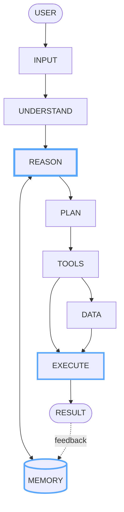
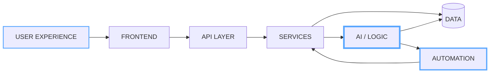
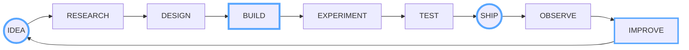
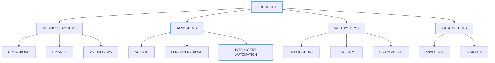
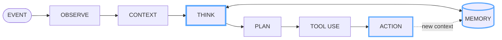
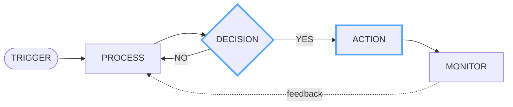
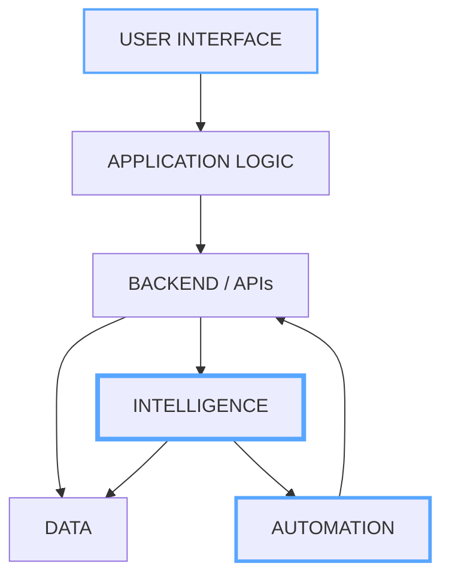
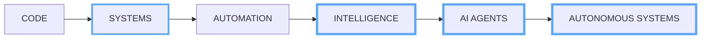

# HARISH KUMAR

 

  

---

# 🧠 INTELLIGENCE LAYER

**Understand · Reason · Plan · Execute · Learn**

---

# 🌐 SYSTEM DESIGN

---

# ⚡ THE BUILD LOOP

### IDEAS BECOME SYSTEMS THROUGH ITERATION.

---

# 🧩 PRODUCT ARCHITECTURE

---

# 🤖 AGENT ARCHITECTURE

`OBSERVE` → `CONTEXT` → `THINK` → `PLAN` → `TOOLS` → `ACTION`

---

# 🔄 AUTOMATION FLOW

---

# 💻 TECHNOLOGY STACK

## 🐍 PYTHON

**AI · Backend · Automation · Data**

Python is a core language for building backend services, AI applications, automation workflows and data-driven systems.

---

## ⚛️ REACT

**Frontend · Interfaces · Applications**

Used to create responsive, component-driven interfaces and modern web applications.

---

## 🔷 TYPESCRIPT

**Application Architecture · Type Safety · Large Systems**

Used when building structured, scalable frontend and application systems where maintainability matters.

---

## 🟨 JAVASCRIPT

**Web Logic · Interaction · Application Development**

Used across web applications, frontend functionality and application-level logic.

---

## ⚡ FASTAPI

**APIs · Backend Services · High-Performance Applications**

Used to build clean Python APIs and connect frontend applications with backend services and data.

---

## 🟢 NODE.JS

**Server-Side JavaScript · APIs · Tooling**

Useful for application services, integrations, automation and JavaScript-based backend workflows.

---

## 🗄️ SQLITE

**Application Data · Local Systems · Prototyping**

Used for lightweight application databases and business-focused software.

---

## 📊 DATA & ANALYTICS

`Python` · `Jupyter` · `Data Analysis` · `Visualization`

Building data workflows that transform raw information into useful insights.

---

## 🔧 ENGINEERING TOOLS

**Version Control · Collaboration · Development**

---

# 🏗️ APPLICATION LAYERS

---

# 📊 ENGINEERING SIGNAL

 

 

---

# 🐍 CONTRIBUTION SIGNAL

---

# 🔮 NEXT

### BUILD → CONNECT → INTELLIGENCE → AUTOMATE → EVOLVE

 

  

# HARISH

**AI · SOFTWARE · AUTOMATION · SYSTEMS**

