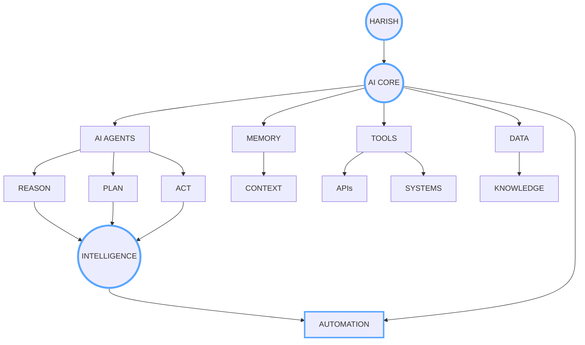
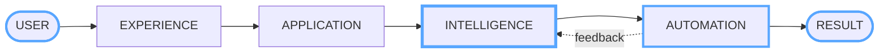
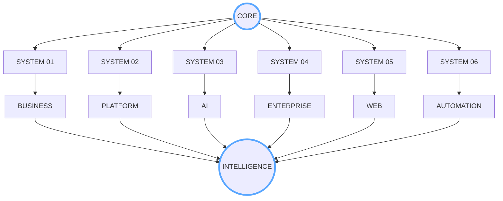
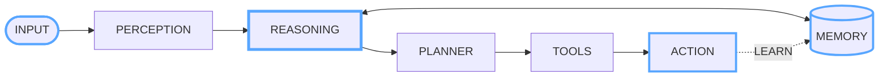
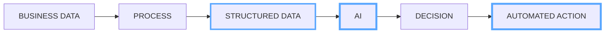
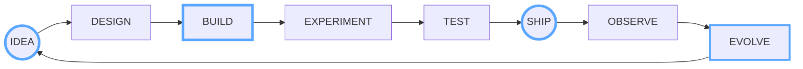
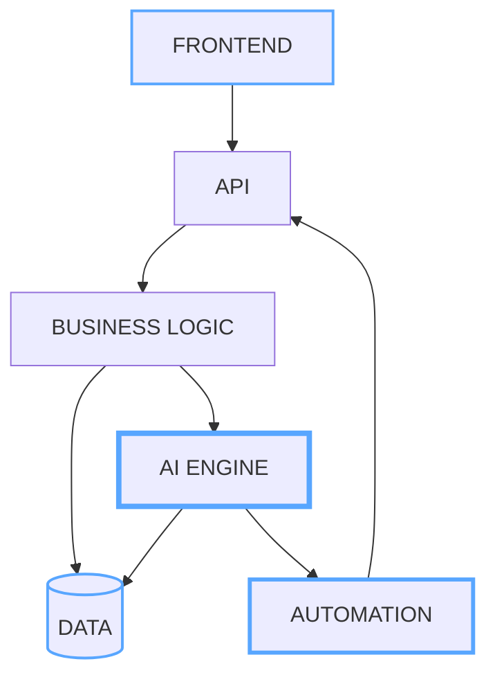
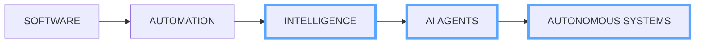

# HARISH KUMAR

 

---

## AI CORE

**Understand → Reason → Act → Automate**

---

## SYSTEM FLOW

---

## PRODUCT ECOSYSTEM

---

## AI AGENT ENGINE

`PERCEIVE` · `REASON` · `REMEMBER` · `PLAN` · `ACT`

---

## BUSINESS INTELLIGENCE

---

## BUILD ENGINE

### CREATE · EXPERIMENT · SHIP · EVOLVE

---

## ENGINEERING

  

`AI` · `FULL STACK` · `BACKEND` · `AUTOMATION` · `DATA` · `SYSTEMS`

---

## ARCHITECTURE

---

## GITHUB TELEMETRY

 

 

---

## ACTIVITY

---

## NEXT

### Building systems that **understand → decide → act**

 

  

# HARISH

`AI` · `SOFTWARE` · `AUTOMATION` · `SYSTEMS`

